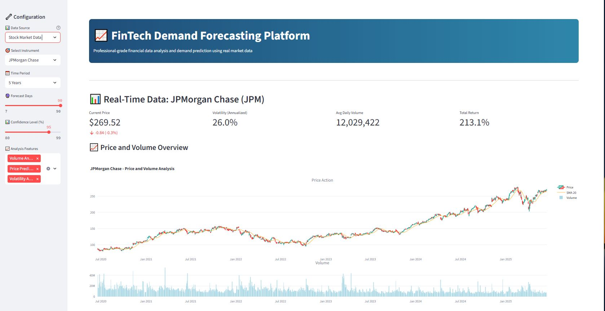
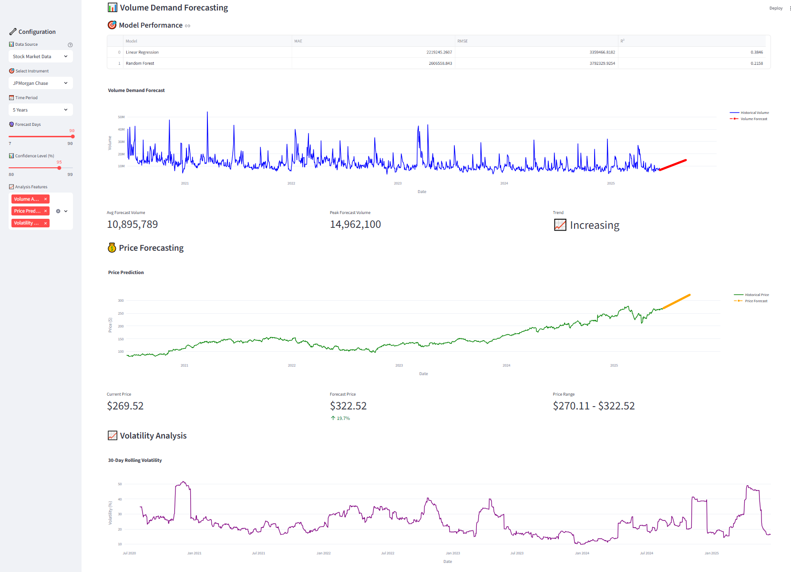
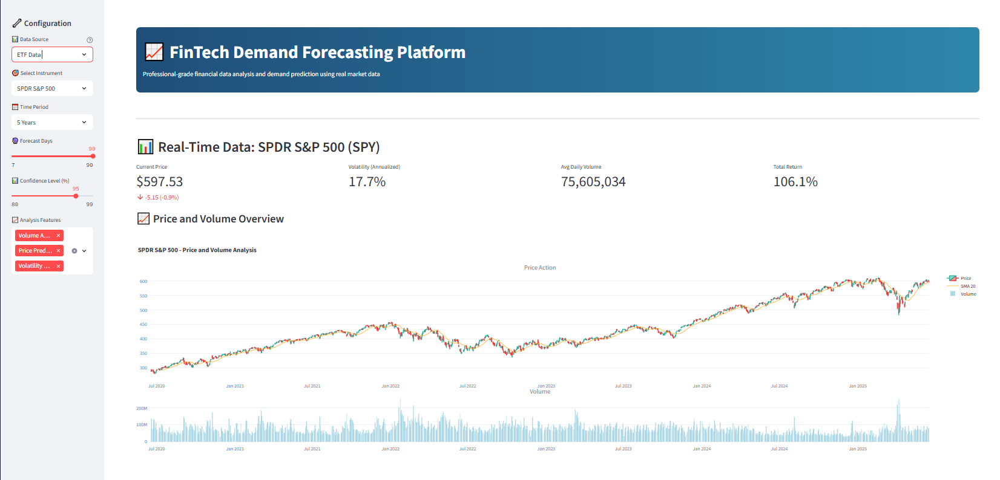
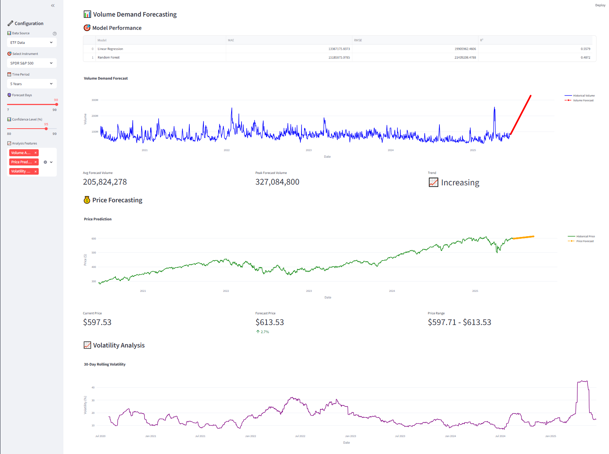
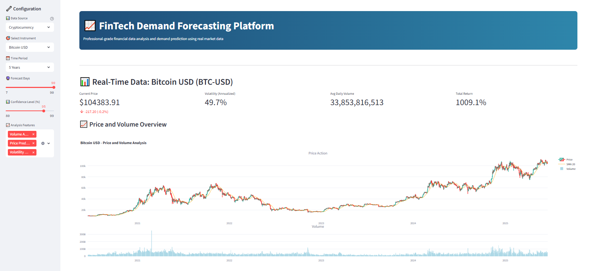
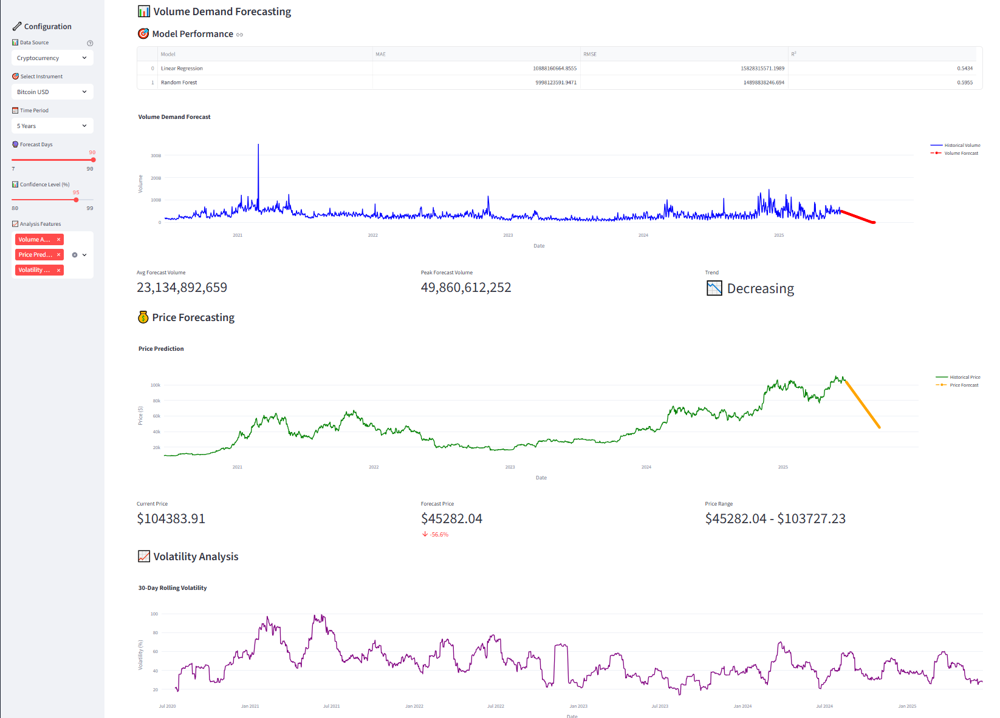

# 📈 FinTech Demand Forecasting Platform

> **Day 1 of 45-Day AI in Payments Challenge**  
> Professional-grade financial data analysis and demand prediction using real market data

## 🎯 Overview

A sophisticated fintech application that leverages Yahoo Finance API to provide real-time financial data analysis and advanced demand forecasting. Built with machine learning models and interactive visualizations for institutional-quality insights.

## ✨ Key Features

### 📊 **Real-Time Financial Data Integration**
- **Live Yahoo Finance API** integration
- **Multi-Asset Support**: Stocks, ETFs, Cryptocurrencies
- **Real-time price feeds** with historical data analysis

### 🎯 **Advanced Forecasting Models**
- **Machine Learning**: Linear Regression + Random Forest
- **Feature Engineering**: Lag variables, rolling statistics, seasonality
- **Model Comparison**: Performance metrics (MAE, RMSE, R²)
- **Confidence Intervals**: Statistical forecasting bounds

### 📈 **Professional Analytics**
- **Volume Demand Forecasting**: Predict trading volume patterns
- **Price Prediction**: Multi-day price forecasting
- **Volatility Analysis**: 30-day rolling volatility tracking
- **Technical Indicators**: RSI, Bollinger Bands, Moving Averages

### 🎨 **Interactive Visualizations**
- **Candlestick Charts**: Professional trading interface
- **Volume Analysis**: Historical and predicted volume trends
- **Forecast Plots**: Interactive time series with confidence bands
- **Technical Overlays**: Multi-indicator analysis charts

## 🖼️ **Screenshots & Demo**

### **📊 Stock Market Analysis**

#### **Price and Volume Overview**

*Real-time stock data with candlestick charts, moving averages, and volume analysis*`1
sss
#### **Volume Demand Forecasting**

*Advanced ML forecasting models predicting future trading volume with confidence intervals*

---

### **📈 ETF Analysis**

#### **Price and Volume Overview**

*Professional ETF analysis with technical indicators and market trends*

#### **Volume Demand Forecasting**

*ETF volume prediction using Random Forest and Linear Regression models*

---

### **₿ Cryptocurrency Analysis**

#### **Price and Volume Overview**

*Cryptocurrency market data with volatility analysis and technical indicators*

#### **Volume Demand Forecasting**

*Crypto volume forecasting with advanced feature engineering and model comparison*

---

## 🏢 **Supported Financial Instruments**

### 📊 **Blue-Chip Stocks**
- **Tech Giants**: Apple (AAPL), Microsoft (MSFT), Google (GOOGL), NVIDIA (NVDA)
- **E-commerce**: Amazon (AMZN), Tesla (TSLA)
- **Financial**: JPMorgan Chase (JPM), Visa (V), PayPal (PYPL)

### 📈 **ETFs**
- **Market Indices**: SPDR S&P 500 (SPY), Invesco QQQ (QQQ)
- **Sector Funds**: Financial Select Sector (XLF)
- **Broad Market**: Vanguard Total Stock (VTI), iShares Russell 2000 (IWM)

### ₿ **Cryptocurrencies**
- **Major Coins**: Bitcoin (BTC-USD), Ethereum (ETH-USD)
- **Altcoins**: Cardano (ADA-USD), Solana (SOL-USD), Polygon (MATIC-USD)

## 🚀 **Quick Start Guide**

### **Option 1: Docker (Recommended)**
```bash
# Clone the repository
git clone <repository-url>
cd fintech_ai_playground/day-01-demand-forcasting

# Build and run with Docker
docker build -t demand-forecasting .
docker run -d -p 8501:8501 demand-forecasting

# Access the application
open http://localhost:8501
```

### **Option 2: Local Installation**
```bash
# Install dependencies
pip install -r requirements.txt

# Run the application
streamlit run app.py

# Access the application
open http://localhost:8501
```

## 📋 **Requirements**

### **Core Dependencies**
```
streamlit>=1.28.0
pandas>=2.0.0
numpy>=1.24.0
plotly>=5.15.0
scikit-learn>=1.3.0
yfinance>=0.2.18
requests>=2.31.0
```

### **System Requirements**
- Python 3.8+ or Docker
- Internet connection (for Yahoo Finance API)
- 4GB+ RAM recommended

## 🎮 **How to Use**

### **1. Configure Data Source**
- Select from **Stock Market Data**, **ETF Data**, **Cryptocurrency**, or **Custom Upload**
- Choose your preferred financial instrument
- Set time period (1 month to 5 years)

### **2. Set Analysis Parameters**
- **Forecast Days**: 7-90 days ahead
- **Confidence Level**: 80-99% statistical confidence
- **Analysis Features**: Volume, Price Prediction, Volatility

### **3. Analyze Results**
- **Real-time Metrics**: Current price, volatility, volume trends
- **Interactive Charts**: Professional candlestick and volume charts
- **ML Forecasts**: Advanced predictions with multiple models
- **Technical Analysis**: RSI, Bollinger Bands, moving averages

### **4. Export & Share**
- **Download Data**: CSV export of historical and forecast data
- **Model Metrics**: Performance comparison between algorithms
- **Business Insights**: Automated recommendations based on trends

## 📊 **Sample Analysis Workflow**

1. **Select Asset**: Choose "Apple Inc. (AAPL)" from Stock Market Data
2. **Set Period**: Select "1 Year" for comprehensive analysis
3. **Configure Forecast**: Set 30-day forecast with 95% confidence
4. **Enable Features**: Select Volume Analysis + Price Prediction
5. **Analyze**: Review real-time metrics and interactive charts
6. **Export**: Download forecast data for further analysis

## 🎯 **Use Cases**

### **Financial Institutions**
- **Risk Management**: Volatility analysis and stress testing
- **Portfolio Optimization**: Asset allocation based on forecasts
- **Trading Strategies**: Volume and price prediction for execution

### **Investment Firms**
- **Due Diligence**: Comprehensive technical analysis
- **Client Reporting**: Professional-grade visualizations
- **Market Research**: Multi-asset comparative analysis

### **Individual Traders**
- **Personal Portfolio**: Track and forecast holdings
- **Trading Decisions**: Technical indicator analysis
- **Education**: Learn financial modeling and analysis

## 🔧 **Technical Architecture**

### **Data Layer**
- **Yahoo Finance API**: Real-time financial data
- **Pandas**: Data manipulation and analysis
- **NumPy**: Numerical computations

### **ML Pipeline**
- **Scikit-learn**: Machine learning models
- **Feature Engineering**: Time series preprocessing
- **Model Validation**: Cross-validation and metrics

### **Visualization**
- **Plotly**: Interactive financial charts
- **Streamlit**: Web application framework
- **Custom CSS**: Professional UI styling

### **Deployment**
- **Docker**: Containerized deployment
- **Requirements**: Dependency management
- **Port 8501**: Streamlit default port

## 📈 **Model Performance**

### **Forecasting Accuracy**
- **Linear Regression**: Fast, interpretable baseline
- **Random Forest**: Advanced ensemble method
- **Feature Engineering**: 9+ engineered features
- **Validation**: Time series cross-validation

### **Metrics Tracked**
- **MAE**: Mean Absolute Error
- **RMSE**: Root Mean Square Error
- **R²**: Coefficient of Determination
- **Confidence Intervals**: Statistical bounds


### **🎯 Key Features Demonstrated**
- **Multi-Asset Support**: Stocks, ETFs, Cryptocurrencies
- **Real-time Data**: Live Yahoo Finance integration
- **Interactive Charts**: Professional candlestick and volume visualizations
- **ML Forecasting**: Advanced prediction models with performance metrics
- **Technical Analysis**: RSI, Bollinger Bands, moving averages
- **Professional UI**: Gradient styling and responsive design
- **Model Comparison**: MAE, RMSE, R² performance evaluation

## ⚠️ **Important Disclaimers**

- **Educational Purpose**: This tool is for educational and research purposes only
- **Not Financial Advice**: Do not use for actual trading decisions without professional consultation
- **Market Risk**: All investments carry risk of loss
- **Data Accuracy**: Yahoo Finance data provided "as-is"

## 🛠️ **Troubleshooting**

### **Common Issues**
```bash
# If container won't start
docker logs <container-id>

# If Yahoo Finance API fails
# Check internet connection and try different symbols

# If requirements fail to install
pip install --upgrade pip
pip install -r requirements.txt --force-reinstall
```

### **Docker Issues**
```bash
# Stop existing containers
docker stop $(docker ps -q --filter ancestor=demand-forecasting)

# Rebuild image
docker build -t demand-forecasting . --no-cache

# Run with logs
docker run -p 8501:8501 demand-forecasting
```

## 🤝 **Contributing**

This is part of a 45-day AI in Payments challenge. Contributions, suggestions, and feedback are welcome!

### **Development Setup**
```bash
# Clone repository
git clone <repository-url>
cd fintech_ai_playground/day-01-demand-forcasting

# Create virtual environment
python -m venv venv
source venv/bin/activate  # On Windows: venv\Scripts\activate

# Install dependencies
pip install -r requirements.txt

# Run in development mode
streamlit run app.py --server.runOnSave true
```

## 📞 **Support**

For questions or issues:
- Check the application logs in the Docker container
- Ensure internet connectivity for Yahoo Finance API
- Verify all dependencies are installed correctly

## 🗂️ **Project Structure**
```
day-01-demand-forcasting/
├── app.py                 # Main Streamlit application
├── requirements.txt       # Python dependencies
├── Dockerfile            # Container configuration
├── readme.md            # This documentation
└── demo.png             # Screenshot (optional)
```

---

## 📊 **Complete Application Screenshots**

### **FinTech Demand Forecasting Platform - Full Demo**

<object data="FinTech Demand Forecasting.pdf" type="application/pdf" width="100%" height="800px">
    <embed src="FinTech Demand Forecasting.pdf" type="application/pdf" width="100%" height="800px" />
    <p>Your browser does not support embedded PDFs. <a href="FinTech Demand Forecasting.pdf">Download the PDF</a> to view the complete application screenshots.</p>
</object>

*Comprehensive documentation showing all features, charts, and analysis capabilities of the FinTech Demand Forecasting Platform*

---

**Built with ❤️ for the FinTech Community**  
*Part of the 45-Day AI in Payments Challenge*

**Access the live application**: http://localhost:8501
